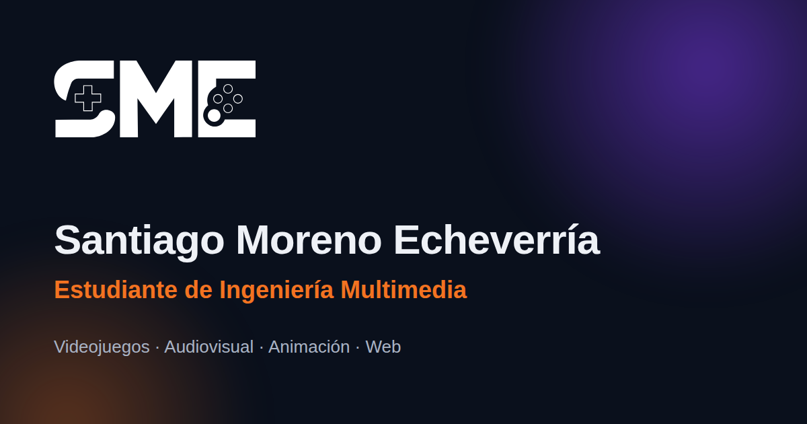

# Santiago Moreno Echeverría — Portafolio



**Sitio en vivo:** [portfolio-santiago-me.vercel.app](https://portfolio-santiago-me.vercel.app/)

Portafolio personal de un **estudiante de Ingeniería Multimedia** (Universidad de San Buenaventura, Bogotá): videojuegos, producción audiovisual, modelado 3D y desarrollo web. Es una aplicación de una sola página hecha con React y Vite. Cada proyecto se puede ver en vivo: el juego, el video o el sitio web.

## Proyectos destacados

| Proyecto | Tipo | Tecnologías | Enlaces |
|---|---|---|---|
| **Itza: El despertar de la lluvia** | Videojuego 3D | Unity, C#, WebGL | [Jugar](https://samefn.itch.io/itza-el-despertar-de-la-lluvia) · [Código](https://github.com/samefn/Itza-el-despertar-de-la-lluvia) |
| **Hasta alcanzarte** | Cortometraje | Dirección de cámara, Premiere Pro, DaVinci Resolve | [Ver](https://www.youtube.com/watch?v=4yPrIC1MTJ8) |
| **Spider-Gwen** | Modelo 3D | Maya, Blender (modelado, rigging, blend shapes) | Visor 3D en el portafolio |
| **Zelda** | Modelo 3D | Maya (rigging y blend shapes sobre un modelo de clase) | Visor 3D en el portafolio |
| **Invitación de 15 años** | Sitio web | React, HTML, CSS, base de datos | [Sitio](https://luciana15yearsinvitation.vercel.app/) · [Código](https://github.com/samefn/Party_Invitation) |
| **SoccerDB** | Aplicación web | Node.js, Express, MySQL, Firebase | [Demo](https://soccerdb-demo.onrender.com/login.html) · [Código](https://github.com/samefn/ProyectDB3) |

## Características

- **Previsualizaciones:** el tráiler o el juego de itch.io, videos de YouTube que se cargan al pulsar play, y sitios web en vivo con vista de escritorio, tableta y móvil.
- **Visor 3D interactivo:** modelos glTF con Three.js. Se pueden girar, ver el esqueleto y la malla, animar el rig y mover cada blend shape facial. Three.js solo se descarga cuando el visitante abre el visor.
- **Galería con filtros y carrusel:** se navega con flechas, puntos, deslizando el dedo o con el teclado.
- **Vista rápida y páginas de detalle:** cada proyecto se abre en una ventana modal y también tiene su propia URL (`/proyectos/:slug`).
- **Habilidades interactivas:** cada área abre una ventana con sus herramientas y competencias.
- **Identidad visual SME:** paleta, tipografías y logotipo del manual de marca, con un fondo de nebulosa hecho solo con CSS.
- **Diseño responsive:** pensado primero para móvil, desde 320 px hasta pantallas grandes.

## Tecnologías

- [React 18](https://react.dev/) + [Vite 5](https://vitejs.dev/)
- [React Router 6](https://reactrouter.com/)
- [Three.js](https://threejs.org/) (visor de modelos glTF)
- [Bootstrap 5](https://getbootstrap.com/) (cuadrícula y utilidades) + [Bootstrap Icons](https://icons.getbootstrap.com/)
- CSS propio con variables de diseño (`src/styles/global.css`)
- Publicado en [Vercel](https://vercel.com/)

## Instalación local

Requiere **Node.js 18** o superior.

```bash
git clone https://github.com/samefn/portafolio.git
cd portafolio
npm install
npm run dev        # desarrollo en http://localhost:5173
```

| Comando | Descripción |
|---|---|
| `npm run dev` | Servidor de desarrollo con recarga en caliente |
| `npm run build` | Genera la versión de producción en `dist/` |
| `npm run preview` | Sirve `dist/` en local para revisarla antes de publicar |

## Estructura

```
├── public/              Archivos estáticos (se copian tal cual a dist/)
│   ├── icons/           Logotipo SME e íconos de herramientas
│   ├── images/          Fotografía, portadas e imagen para redes
│   ├── models/          Modelos 3D en formato .glb
│   └── cv.pdf
├── src/
│   ├── components/      Componentes de la interfaz
│   ├── data/            Contenido: profile.js y projects.js
│   ├── hooks/           useReveal (animaciones) y useDialog (modales accesibles)
│   ├── pages/           Home y ProjectDetail
│   └── styles/          global, components y responsive
├── index.html
├── vercel.json          Rutas de la SPA y caché de recursos
└── vite.config.js
```

Todo el contenido está en `src/data/`. Para agregar un proyecto o una herramienta basta con editar `projects.js` o `profile.js`, sin tocar los componentes.

## Despliegue

El sitio se publica en Vercel desde la rama `main`. Cada `git push` genera una nueva versión automáticamente. `vercel.json` redirige todas las rutas a `index.html` para que las URL de los proyectos funcionen al recargar la página.

## Accesibilidad y rendimiento

- Navegación completa con teclado, enlace para saltar al contenido y foco visible.
- Ventanas modales con `role="dialog"`: atrapan el foco y se cierran con Esc.
- Respeta `prefers-reduced-motion`.
- La página de detalle se carga bajo demanda y React va en un archivo aparte para aprovechar la caché.
- Imágenes en WebP con carga diferida. Los videos e iframes externos solo se cargan cuando el usuario los pide.

## Contacto

**Santiago Moreno Echeverría** — Estudiante de Ingeniería Multimedia

- Hoja de vida: [cv.pdf](public/cv.pdf)

- Correo: [santiagomorenoe@gmail.com](mailto:santiagomorenoe@gmail.com)
- LinkedIn: [santiago-moreno-echeverria](https://www.linkedin.com/in/santiago-moreno-echeverria)
- GitHub: [samefn](https://github.com/samefn)
- itch.io: [samefn](https://samefn.itch.io/)

---

© Santiago Moreno Echeverría. El logotipo SME, la fotografía y el contenido de los proyectos son de su autor y no se pueden reutilizar sin permiso.
